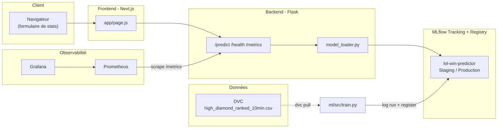

# League Win Predictor — Projet Final MLOps

Prédit la probabilité de victoire de l'équipe bleue dans une partie classée de
**League of Legends**, à partir des statistiques de la 10ᵉ minute (or, kills,
dragons, hérauts...). C'est le prétexte "métier" du projet — l'objectif réel,
demandé par le sujet (`final project 2026.pdf`), est de construire le cycle de
vie MLOps complet autour de ce modèle : versioning des données, tracking
d'expériences, registre de modèles, CI/CD à portes de qualité, promotion
automatique, monitoring, et déploiement cloud.

Ce document explique **chaque grande partie** : ce qui a été fait, à quoi ça
correspond dans le sujet, et pourquoi c'est construit comme ça.

## Sommaire

1. [Vue d'ensemble et architecture](#1-vue-densemble-et-architecture)
2. [Le dataset et DVC](#2-le-dataset-et-dvc)
3. [Entraînement et MLflow](#3-entraînement-et-mlflow)
4. [Le pipeline de promotion de modèle](#4-le-pipeline-de-promotion-de-modèle)
5. [Le backend Flask](#5-le-backend-flask)
6. [Le frontend Next.js](#6-le-frontend-nextjs)
7. [Les tests](#7-les-tests)
8. [Lint + Git hooks](#8-lint--git-hooks)
9. [Modèle de branches Git](#9-modèle-de-branches-git)
10. [CI/CD — les 3 pipelines GitHub Actions](#10-cicd--les-3-pipelines-github-actions)
11. [Monitoring Prometheus + Grafana](#11-monitoring-prometheus--grafana)
12. [12-factor / configuration](#12-12-factor--configuration)
13. [Déploiement cloud](#13-déploiement-cloud)
14. [Reproduire le projet de zéro](#14-reproduire-le-projet-de-zéro)
15. [Ce qu'il te reste à faire](#15-ce-quil-te-reste-à-faire)

---

## 1. Vue d'ensemble et architecture



**Pourquoi ce découpage ?** Le sujet impose explicitement : un backend qui sert
un modèle ML, un frontend NodeJS (React/Next), un registre de modèles comme
**unique source de vérité pour le déploiement**, et un monitoring séparé de
l'application elle-même. Chaque brique ci-dessus correspond à une exigence
précise du sujet — le détail est expliqué section par section.

Arborescence :

```
league-win-predictor/
├── backend/        # API Flask qui sert le modèle
├── frontend/        # UI Next.js
├── ml/               # données (DVC) + entraînement/promotion (MLflow)
├── tests/            # unit / integration / e2e
├── monitoring/        # Prometheus + Grafana (provisioning)
├── .github/workflows/ # les 3 pipelines CI/CD
├── .githooks/         # pre-push (lint + tests)
└── docker-compose.yml # tout faire tourner en local en une commande
```

---

## 2. Le dataset et DVC

**Ce qui a été fait** : téléchargement du vrai dataset Kaggle *"League of
Legends Diamond Ranked Games (10 min)"* (9879 parties classées Diamond I à
Master, 40 colonnes, aucune valeur manquante, cible équilibrée ~50/50), placé
dans `ml/data/raw/high_diamond_ranked_10min.csv`, puis suivi avec DVC :

```bash
dvc init
dvc add ml/data/raw/high_diamond_ranked_10min.csv   # crée le .dvc (pointeur)
dvc remote add -d storage .dvc-remote                # stockage "distant"
dvc push
```

**À quoi ça correspond** : section *"Data Versioning (DVC)"* du sujet — suivre
les données brutes, les stocker à distance, et pouvoir tracer chaque run
d'entraînement à une version de données précise (hash MD5 DVC) + un commit Git.

**Pourquoi un remote DVC local (`.dvc-remote/`) plutôt que S3/Google Drive ?**
Le cours (`14-DVC.pdf`) montre les deux, mais S3/GDrive demandent un compte
cloud et des identifiants que je n'ai pas à ta place. `.dvc-remote/` est un
dossier **committé dans le repo** : ça reproduit exactement le même mécanisme
DVC (pointeur `.dvc` dans Git, données réelles ailleurs, `dvc pull` les
restaure), mais ça marche immédiatement après un `git clone`, y compris dans
la CI, sans aucun secret à configurer. Vérifié : suppression du fichier +
cache local, puis `dvc pull` → fichier restauré à l'identique (même hash MD5).

**Pour passer à un vrai remote cloud** (recommandé une fois le projet en
équipe) : une seule commande à changer, ex. pour S3 :
```bash
dvc remote add -d storage s3://ton-bucket/lol-data
dvc push
```
et ajouter les credentials AWS en secrets GitHub pour que la CI puisse
`dvc pull`.

---

## 3. Entraînement et MLflow

**Ce qui a été fait** — `ml/src/train.py` :
- charge `high_diamond_ranked_10min.csv`, split train/test stratifié,
- entraîne une régression logistique (ou random forest, `--model-type`),
- logge dans MLflow : paramètres, métriques (`accuracy`, `f1`, `precision`,
  `recall`, `roc_auc`), et deux **tags de traçabilité** : `git_commit` (hash du
  commit courant) et `dvc_data_version` (hash MD5 lu dans le `.dvc`),
- avec `--register` : enregistre le modèle dans le **MLflow Model Registry**
  sous le nom `lol-win-predictor` et le passe au stage **Staging**.

Résultat réel obtenu en local (régression logistique, seed=42) :
**accuracy = 0.7196**, roc_auc = 0.806 — cohérent avec les benchmarks publiés
sur ce dataset (~72-73%).

**À quoi ça correspond** : *"Model Versioning & Registry (MLflow + DagsHub)"*
— chaque version de modèle doit logger métriques, paramètres, version de
données et version de code, et le registre doit être la source de vérité des
déploiements.

**Pourquoi ces tags précisément ?** C'est la définition littérale du sujet de
la traçabilité : *"Every training run must be traceable to: a DVC data
version, a Git commit hash."*

**MLflow + DagsHub (connecté)** : le tracking et le registre sont hébergés sur
DagsHub — registre partagé, visible par toute l'équipe :
<https://dagshub.com/wassimdjenane344/league-win-predictor.mlflow>. Les
identifiants (`MLFLOW_TRACKING_URI`, `MLFLOW_TRACKING_USERNAME`,
`MLFLOW_TRACKING_PASSWORD`) sont stockés dans les GitHub Secrets des
environments `staging` et `production`, jamais en dur. En local, si aucun
`MLFLOW_TRACKING_URI` n'est défini, le code retombe sur `ml/mlruns` (file
store local) — le code ne change pas, `mlflow.set_tracking_uri()` lit
simplement la variable d'env. DagsHub sert aussi de **remote DVC** (le dataset
y est stocké en plus du remote local) — c'est le "store data remotely" du sujet.

---

## 4. Le pipeline de promotion de modèle

**Ce qui a été fait** — `ml/src/promote.py`, la pièce centrale demandée par
*"Model Promotion Pipeline (Core Requirement)"* :

1. récupère la version actuellement en stage **Staging** du modèle,
2. la réévalue sur un jeu de test tenu à l'écart (même split que
   l'entraînement, donc comparable),
3. applique la **porte de qualité** (`ml/src/evaluate.py`) : `accuracy >= 0.70`,
4. **si ça passe** : promotion vers **Production** (l'ancienne version
   Production est archivée) ;
   **si ça échoue** : le script sort avec un code d'erreur (`sys.exit(1)`),
   le modèle reste en Staging, Production n'est pas touché.

Testé en conditions réelles : entraînement → `accuracy=0.7196` (≥ 0.70) →
promotion effective vers Production, confirmée par les logs MLflow.

**Pourquoi une seule porte de qualité (accuracy) plutôt que plusieurs ?** Le
sujet dit *"at least one required"* — j'ai choisi l'accuracy car c'est la
métrique la plus directement liée à l'utilité du modèle pour ce cas d'usage
(prédire un gagnant). Le code est structuré pour qu'ajouter une deuxième porte
(latence, compatibilité de schéma) soit un simple ajout dans `evaluate.py`.

**Où ça se déclenche** : c'est l'étape centrale du pipeline `staging -> main`
(section 10) — la fusion de `staging` vers `main` ne peut aboutir à un déploiement
prod que si cette porte est franchie.

---

## 5. Le backend Flask

**Ce qui a été fait** — `backend/app/` :
- `main.py` : factory `create_app()` (repris du pattern du TP
  *"Linting, Testing & Git Hooks for a Flask App"*), avec 3 routes :
  - `GET /health` → statut + métadonnées du modèle chargé (nom, version,
    stage, commit, version de données),
  - `POST /predict` → construit le vecteur de features (`features.py`),
    interroge le modèle, renvoie la probabilité de victoire + métadonnées,
  - `GET /metrics` → export Prometheus.
- `model_loader.py` : charge le modèle **directement depuis le MLflow Model
  Registry** (`models:/lol-win-predictor/<stage>`), jamais depuis un fichier
  local — exigence explicite du sujet : *"the registry is the single source
  of truth for deployments"* et *"production must serve predictions from the
  Production registry stage only"*. Le stage à charger vient de la variable
  d'env `MLFLOW_MODEL_STAGE` (`Staging` en environnement staging, `Production`
  en prod) — **même image Docker dans les deux environnements**, seule la
  configuration change (12-factor, section 12).
- `metrics.py` : compteurs/histogramme Prometheus (section 11).

Vérifié en local : `/health`, `/predict` (payload complet et partiel — les
champs omis prennent la valeur médiane du dataset) et `/metrics` répondent
correctement, avec un vrai modèle chargé depuis le registre.

---

## 6. Le frontend Next.js

**Ce qui a été fait** — `frontend/` (Next.js 15, App Router) : une page unique
(`app/page.js`) avec un formulaire pour les statistiques clés d'une partie
(kills, morts, assists, écart d'or/XP, dragons, hérauts, tours, wards), qui
appelle `POST {NEXT_PUBLIC_API_URL}/predict` et affiche le résultat sous forme
de barre bleu/rouge + le modèle/commit/version de données ayant servi la
prédiction (traçabilité visible jusque dans l'UI).

**Pourquoi Next.js plutôt que du React pur ?** C'est la recommandation
explicite du sujet (*"a NodeJS framework for the frontend, like ReactJS or
NextJS"*) ; Next.js apporte un build de prod optimisé et un serveur Node
autonome (`output: "standalone"`) pratique à conteneuriser.

Build de production vérifié (`npm run build`) et flux complet testé
manuellement (formulaire → requête → affichage du résultat).

---

## 7. Les tests

Exigence du sujet : *"3 unit tests, 2 integration tests, 1 end-to-end test"*,
tous automatisés en CI. J'en ai fait plus que le minimum, pour que chaque test
soit vraiment utile plutôt que de la figuration :

| Type | Fichiers | Ce qu'ils vérifient |
|---|---|---|
| Unit (6) | `tests/unit/test_features.py`, `test_evaluate.py`, `test_versioning.py` | construction du vecteur de features, décision de la porte de qualité (au-dessus/en-dessous du seuil), parsing du hash DVC — fonctions pures, aucune I/O réseau/modèle |
| Integration (4) | `tests/integration/test_health_endpoint.py`, `test_predict_endpoint.py` | vraie app Flask + vrai modèle chargé depuis un registre MLflow jetable, sur `/health` et `/predict` (cas valide, cas favorable à bleu, cas de payload invalide → 400) |
| E2E (1) | `tests/e2e/test_e2e_selenium.py` | Selenium/Chrome headless pilote le vrai frontend, remplit le formulaire, vérifie que le résultat s'affiche — bout en bout navigateur → Next.js → Flask → MLflow |

**Pourquoi un registre MLflow "jetable" pour les tests d'intégration ?**
(`tests/conftest.py`) : pour que les tests exercent le **vrai** code
d'entraînement + de chargement de modèle (pas de mock), sans dépendre d'un
serveur MLflow partagé. Chaque session de test entraîne et enregistre un vrai
modèle dans un dossier temporaire.

Tout est passé en local : `10 passed` (unit+integration) et `1 passed` (e2e,
Chrome réel).

Lancer localement :
```bash
pip install -r requirements-dev.txt
dvc pull
pytest tests/unit tests/integration -v
# pour l'e2e : démarrer backend + frontend dans deux terminaux, puis
pytest tests/e2e -v
```

---

## 8. Lint + Git hooks

**Ce qui a été fait** : configuration `ruff` dans `pyproject.toml` (reprise du
TP *"Linting, Testing & Git Hooks"*, adaptée aux deux dossiers de code source
`backend/app` et `ml/src`), et un hook `pre-push` (`.githooks/pre-push`) qui
lance `ruff check` puis `pytest tests/unit tests/integration` avant chaque
`git push`.

**Pourquoi `.githooks/` et pas directement `.git/hooks/pre-push` comme dans le
TP ?** `.git/hooks/` n'est **jamais versionné par Git** — chaque
collègue devrait recréer le hook à la main. En committant le hook dans
`.githooks/` et en configurant `core.hooksPath` (une commande, voir
`scripts/setup-git-hooks.sh`), le hook est partagé automatiquement par toute
l'équipe dès le clone.

Comportement vérifié exactement comme demandé par le TP :
1. ligne de code volontairement mal formée ajoutée → `ruff check` échoue →
   le hook s'arrête (`set -e`), le push aurait été bloqué ;
2. erreur corrigée → `ruff check` puis `pytest` passent tous les deux → le
   hook se termine avec succès.

Installation (une fois, après clone) :
```bash
bash scripts/setup-git-hooks.sh      # ou scripts/setup-git-hooks.ps1 sous PowerShell
```

---

## 9. Modèle de branches Git

Exigence stricte du sujet :

- `feature/*` — tout le développement
- `dev` — branche d'intégration
- `staging` — validation pré-prod
- `main` — production

Chaque flèche `feature -> dev -> staging -> main` correspond à un des 3
pipelines CI/CD ci-dessous, déclenché automatiquement par GitHub Actions.

---

## 10. CI/CD — les 3 pipelines GitHub Actions

### `PR -> dev` (`.github/workflows/pr-to-dev.yml`)
Se déclenche sur toute pull request ciblant `dev`. Étapes : `dvc pull`,
`ruff check`, tests unitaires, tests d'intégration, puis **build** (sans push)
des images Docker backend et frontend. Si tout passe, la PR peut être
fusionnée dans `dev` — exactement la liste d'étapes du sujet.

### `dev -> staging` (`.github/workflows/dev-to-staging.yml`)
Se déclenche au push sur `staging`. C'est le pipeline le plus chargé :
1. **suite de tests complète** : unit + integration, puis démarrage réel du
   backend et du frontend (en arrière-plan, avec attente active sur
   `/health`), et exécution du test e2e Selenium contre ce vrai environnement ;
2. **entraînement du modèle candidat** : `ml/src/train.py --register` — cette
   run est taguée avec le commit qui a déclenché le pipeline et la version
   DVC courante, puis enregistrée en Registry et déplacée en stage
   `Staging` ;
3. **déploiement** : un `curl` vers un *deploy hook* (variable
   `STAGING_DEPLOY_HOOK_URL`, voir section 13) qui redéploie le backend/
   frontend de staging — au redémarrage, le backend recharge automatiquement
   le modèle actuellement en `Staging` (`MLFLOW_MODEL_STAGE=Staging` dans
   l'environment GitHub `staging`). C'est ce qui réalise concrètement *"deploy
   candidate model from registry (MLFlow)"* : pas d'étape séparée nécessaire,
   le mécanisme de chargement par stage s'en charge.

### `staging -> main` (`.github/workflows/staging-to-main.yml`)
Se déclenche au push sur `main`. Une seule étape décisive :
`python ml/src/promote.py` (section 4). Si la porte de qualité échoue, le job
échoue et **l'étape de déploiement suivante ne s'exécute jamais** (GitHub
Actions saute les étapes suivantes d'un job en échec) — Production reste
inchangée, exactement l'exigence *"model stays in Staging, production must
not change"*. Si elle réussit, un second `curl` déclenche le déploiement en
production.

**Secrets/variables GitHub à configurer** (par *environment* GitHub —
Settings → Environments → `staging` / `production`) :
- Secrets : `MLFLOW_TRACKING_URI`, `MLFLOW_TRACKING_USERNAME`,
  `MLFLOW_TRACKING_PASSWORD`
- Variables : `STAGING_DEPLOY_HOOK_URL`, `PRODUCTION_DEPLOY_HOOK_URL`

C'est la réponse concrète à l'exigence *12-Factor App* du sujet : *"The
different environments need unique environment variables, which are to be
generated from github secrets in their respective workflows"* — chaque
environment GitHub a son propre jeu de secrets, injecté uniquement dans le
job qui déclare `environment: staging` ou `environment: production`.

---

## 11. Monitoring Prometheus + Grafana

**Ce qui a été fait** :
- `backend/app/metrics.py` expose sur `/metrics` exactement les métriques
  demandées : `predict_requests_total` (volume), `predict_request_latency_seconds`
  (latence, histogramme → permet un p95 dans Grafana), `predict_requests_failed_total`
  (erreurs), `app_up` (santé) — même pattern que le TP *"Monitoring with
  prometheus"* (`prometheus_client`, compteurs incrémentés dans les routes).
- `monitoring/prometheus/prometheus.yml` scrape ce endpoint toutes les 5s.
- `monitoring/grafana/` provisionne **automatiquement** (pas de clic-ouí dans
  l'UI) la datasource Prometheus et un dashboard
  (`backend-overview.json`) avec les 4 panneaux exigés : volume de requêtes,
  latence p95, taux d'erreur, statut de santé.
- `docker-compose.yml` lance tout ensemble : `backend`, `frontend`,
  `prometheus` (port 9090), `grafana` (port 3001, login `admin`/`admin`).

**Pour surveiller la vraie prod** (le sujet insiste : *"Monitoring should run
against the live production deployment"*) : changer la cible dans
`monitoring/prometheus/prometheus.yml` pour l'URL publique du backend déployé
(voir le commentaire dans le fichier), et héberger ce Prometheus/Grafana sur
la même plateforme cloud que le reste (Render/Railway proposent aussi des
services Docker gratuits pour ça).

---

## 12. 12-factor / configuration

Toute valeur qui change selon l'environnement vient d'une variable d'env,
jamais d'une valeur en dur (`backend/app/config.py`, `.env.example`) :
`ENVIRONMENT`, `MLFLOW_TRACKING_URI`, `MLFLOW_MODEL_STAGE`, `CORS_ORIGINS`,
`PORT`, `NEXT_PUBLIC_API_URL`, etc. En local, ces valeurs viennent d'un
`.env` (copié depuis `.env.example`, jamais committé) ; en CI/CD elles
viennent des secrets/variables du GitHub *Environment* concerné (section 10).

Un détail d'implémentation à connaître si tu modifies le backend :
`MLFLOW_TRACKING_URI`, `MLFLOW_MODEL_NAME` et `MLFLOW_MODEL_STAGE` sont lus à
**chaque appel** (pas mis en cache au démarrage) dans `model_loader.py` — ça
permet aux tests de changer d'environnement à la volée (`monkeypatch.setenv`)
et ça reflète ce qui se passe réellement en prod : chaque worker gunicorn lit
son environnement à son propre démarrage.

---

## 13. Déploiement cloud

Le sujet laisse le choix de la plateforme (Render, Railway, Scalingo, Koyeb...).
Le repo fournit un **blueprint `render.yaml`** qui décrit les 2 services
(backend + frontend) prêts à déployer sur [Render](https://render.com).

Étapes (Render) :

1. Créer un compte sur render.com (connexion via GitHub, autoriser le repo).
2. **New + → Blueprint** → choisir ce repo → Render lit `render.yaml` et crée
   `lol-backend` et `lol-frontend`.
3. Dans les réglages du **backend**, renseigner les 3 secrets marqués
   `sync: false` (mêmes valeurs que les GitHub Secrets de l'environment
   `production` : `MLFLOW_TRACKING_URI`, `MLFLOW_TRACKING_USERNAME`,
   `MLFLOW_TRACKING_PASSWORD`). Déployer → récupérer l'URL publique du backend.
4. Renseigner `CORS_ORIGINS` (backend) = URL du frontend, et
   `NEXT_PUBLIC_API_URL` (frontend) = URL du backend, puis redéployer le
   frontend (cette variable est compilée dans le build Next.js).
5. Récupérer l'URL de *deploy hook* de chaque service (Settings → Deploy Hook)
   et la mettre dans les variables GitHub `PRODUCTION_DEPLOY_HOOK_URL` (et
   `STAGING_DEPLOY_HOOK_URL` si tu déploies aussi un environnement staging) —
   c'est ce que les workflows appellent pour redéployer après un train/promote
   réussi (section 10).

Les Dockerfiles écoutent sur le port `$PORT` fourni par la plateforme et se
lient à `0.0.0.0`, donc ils fonctionnent tels quels sur Render/Railway/etc.

---

## 14. Reproduire le projet de zéro

```bash
git clone <ton-repo>
cd league-win-predictor

python -m venv .venv && source .venv/Scripts/activate   # Windows: .venv\Scripts\activate
pip install -r requirements-dev.txt

dvc pull                      # récupère high_diamond_ranked_10min.csv

cd ml/src
python train.py --model-type logreg --register   # entraîne + enregistre en Staging
python promote.py                                  # porte de qualité -> Production
cd ../..

bash scripts/setup-git-hooks.sh

# Backend
cd backend && python -m flask --app wsgi:app run --port 5000

# Frontend (autre terminal)
cd frontend && npm install && npm run dev

# Ou tout en une fois avec le monitoring :
docker-compose up --build
# app: http://localhost:3000 | api: http://localhost:5000
# prometheus: http://localhost:9090 | grafana: http://localhost:3001
```

---

## 15. Ce qu'il te reste à faire

Tout ce qui précède est construit, testé et validé **en local**. Il reste des
étapes qui demandent tes propres comptes (je ne peux pas les créer à ta
place) :

Déjà fait : repo GitHub + 4 branches, les 3 pipelines CI/CD verts, DagsHub
connecté (registre MLflow + remote DVC), et les GitHub Secrets MLflow posés
sur les environments `staging` et `production`.

Il reste uniquement ce qui dépend d'un hébergeur cloud :

1. **Créer les services d'hébergement** (Render/Railway/...) pour le backend
   et le frontend → obtenir l'**URL publique** de production (livrable noté).
2. **Renseigner les deploy hooks** comme variables GitHub
   `STAGING_DEPLOY_HOOK_URL` / `PRODUCTION_DEPLOY_HOOK_URL` (section 10) — les
   étapes "Deploy" des workflows sont *skipped* tant qu'elles sont vides.
3. **Pointer le monitoring sur la prod live** : changer la cible dans
   `monitoring/prometheus/prometheus.yml` pour l'URL publique du backend, et
   héberger Prometheus/Grafana (section 11).
4. Travailler désormais **exclusivement via des branches `feature/*`** vers
   `dev`, laisser les pipelines CI/CD faire le reste.
