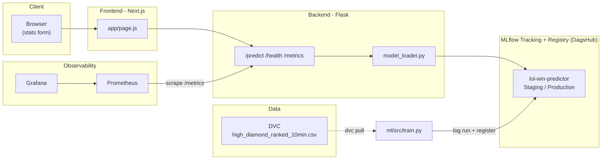

# League Win Predictor — MLOps Final Project

Predicts the **blue team's win probability** in a ranked **League of Legends**
game from the first-10-minutes stats (gold, kills, dragons, heralds…). The game
is just the "business" pretext — the real goal, set by the assignment
(`final project 2026.pdf`), is to build the **full MLOps lifecycle** around that
model: data versioning, experiment tracking, a model registry, CI/CD with
quality gates, automatic promotion, monitoring, and cloud deployment.

**Live app:** https://lol-frontend-scaw.onrender.com
**Model registry (DagsHub):** https://dagshub.com/wassimdjenane344/league-win-predictor.mlflow

This document explains **every major part**: what was done, which assignment
requirement it maps to, and why it is built this way.

## Table of contents

1. [Overview & architecture](#1-overview--architecture)
2. [Dataset & DVC](#2-dataset--dvc)
3. [Training & MLflow](#3-training--mlflow)
4. [The model promotion pipeline](#4-the-model-promotion-pipeline)
5. [The Flask backend](#5-the-flask-backend)
6. [The Next.js frontend](#6-the-nextjs-frontend)
7. [Tests](#7-tests)
8. [Lint & Git hooks](#8-lint--git-hooks)
9. [Git branching model](#9-git-branching-model)
10. [CI/CD — the 3 GitHub Actions pipelines](#10-cicd--the-3-github-actions-pipelines)
11. [Prometheus + Grafana monitoring](#11-prometheus--grafana-monitoring)
12. [12-factor / configuration](#12-12-factor--configuration)
13. [Cloud deployment](#13-cloud-deployment)
14. [Reproduce the project from scratch](#14-reproduce-the-project-from-scratch)
15. [Project status](#15-project-status)

---

## 1. Overview & architecture



**Why this split?** The assignment explicitly requires: a backend serving an ML
model, a NodeJS frontend (React/Next), a model registry as the **single source
of truth for deployment**, and monitoring that is separate from the app itself.
Each box above maps to a specific requirement — detailed section by section.

Project layout:

```
league-win-predictor/
├── backend/          # Flask API that serves the model
├── frontend/         # Next.js UI
├── ml/               # data (DVC) + training/promotion (MLflow)
├── tests/            # unit / integration / e2e
├── monitoring/       # Prometheus + Grafana (provisioning)
├── .github/workflows/# the 3 CI/CD pipelines
├── .githooks/        # pre-push (lint + tests)
├── render.yaml       # Render blueprint (backend + frontend)
└── docker-compose.yml# run the whole stack locally in one command
```

---

## 2. Dataset & DVC

**What was done:** downloaded the real Kaggle dataset *"League of Legends
Diamond Ranked Games (10 min)"* (9,879 Diamond I–Master games, 40 columns, no
missing values, balanced target ~50/50), placed at
`ml/data/raw/high_diamond_ranked_10min.csv`, then tracked with DVC:

```bash
dvc init
dvc add ml/data/raw/high_diamond_ranked_10min.csv   # creates the .dvc pointer
dvc remote add -d storage .dvc-remote                # "remote" storage
dvc push
```

**Maps to:** the *"Data Versioning (DVC)"* section — track the raw data, store
it remotely, and make every training run traceable to a precise data version
(DVC MD5 hash) + a Git commit.

**Why a local DVC remote (`.dvc-remote/`) as well?** The course (`14-DVC.pdf`)
shows both, but S3/GDrive need a cloud account and credentials. `.dvc-remote/`
is a folder **committed in the repo**: it reproduces the exact DVC mechanism
(`.dvc` pointer in Git, real data elsewhere, `dvc pull` restores it) but works
immediately after `git clone`, including in CI, with no secret to configure.
Verified: delete the file + local cache, `dvc pull` → file restored identically
(same MD5 hash). The dataset is **also pushed to DagsHub** as a real cloud DVC
remote, satisfying the "store data remotely" requirement.

---

## 3. Training & MLflow

**What was done** — `ml/src/train.py`:
- loads `high_diamond_ranked_10min.csv`, stratified train/test split,
- trains a logistic regression (or random forest, `--model-type`),
- logs to MLflow: parameters, metrics (`accuracy`, `f1`, `precision`, `recall`,
  `roc_auc`), and two **traceability tags**: `git_commit` (current commit hash)
  and `dvc_data_version` (MD5 read from the `.dvc` pointer),
- with `--register`: registers the model in the **MLflow Model Registry** as
  `lol-win-predictor` and moves it to the **Staging** stage.

Real result (logistic regression, seed=42): **accuracy = 0.7196**,
roc_auc = 0.806 — consistent with published benchmarks on this dataset (~72-73%).

**Maps to:** *"Model Versioning & Registry (MLflow + DagsHub)"* — every model
version must log metrics, parameters, data version and code version, and the
registry must be the single source of truth for deployments.

**Why exactly those tags?** They are the literal definition of traceability in
the assignment: *"Every training run must be traceable to: a DVC data version,
a Git commit hash."*

**MLflow + DagsHub (connected):** tracking and the registry are hosted on
DagsHub — a shared registry visible to the whole team:
<https://dagshub.com/wassimdjenane344/league-win-predictor.mlflow>. The
credentials (`MLFLOW_TRACKING_URI`, `MLFLOW_TRACKING_USERNAME`,
`MLFLOW_TRACKING_PASSWORD`) live in the GitHub Secrets of the `staging` and
`production` environments, never hard-coded. Locally, if `MLFLOW_TRACKING_URI`
is unset, the code falls back to `ml/mlruns` (a local file store) — the code
does not change, `mlflow.set_tracking_uri()` simply reads the env var.

---

## 4. The model promotion pipeline

**What was done** — `ml/src/promote.py`, the centerpiece required by *"Model
Promotion Pipeline (Core Requirement)"*:

1. fetch the model version currently in the **Staging** stage,
2. re-evaluate it on a held-out test split (same split as training, so
   comparable),
3. apply the **quality gate** (`ml/src/evaluate.py`): `accuracy >= 0.70`,
4. **if it passes**: promote to **Production** (the previous Production version
   is archived);
   **if it fails**: the script exits non-zero (`sys.exit(1)`), the model stays
   in Staging, Production is untouched.

Verified end to end: training → `accuracy=0.7196` (≥ 0.70) → actual promotion to
Production, confirmed by the MLflow/DagsHub registry (v_n Production, previous
version Archived).

**Why a single quality gate (accuracy)?** The assignment says *"at least one
required"* — accuracy is the metric most directly tied to the model's usefulness
here (predicting a winner). The code is structured so adding a second gate
(latency, schema compatibility) is a one-line addition in `evaluate.py`.

**Where it runs:** it is the decisive step of the `staging -> main` pipeline
(section 10) — merging `staging` into `main` only deploys to production if this
gate passes.

---

## 5. The Flask backend

**What was done** — `backend/app/`:
- `main.py`: `create_app()` factory (from the *"Linting, Testing & Git Hooks for
  a Flask App"* lab), with 3 routes:
  - `GET /health` → status + loaded-model metadata (name, version, stage,
    commit, data version),
  - `POST /predict` → builds the feature vector (`features.py`), queries the
    model, returns the win probability + metadata,
  - `GET /metrics` → Prometheus export.
  Startup is resilient: if the model can't load (e.g. DagsHub is briefly slow
  during a deploy), `/health` still comes up and the model is loaded lazily on
  the first `/predict`, so a transient hiccup never fails a deploy.
- `model_loader.py`: loads the model **directly from the MLflow Model Registry**
  (`models:/lol-win-predictor/<stage>`), never from a local file — an explicit
  requirement: *"the registry is the single source of truth for deployments"*
  and *"production must serve predictions from the Production registry stage
  only"*. The stage comes from the `MLFLOW_MODEL_STAGE` env var (`Staging` in
  staging, `Production` in prod) — **the same Docker image in both
  environments**, only the config differs (12-factor, section 12).
- `metrics.py`: Prometheus counters/histogram (section 11).

Verified in production: `/health`, `/predict` and `/metrics` all respond, with a
real model loaded from the DagsHub registry.

---

## 6. The Next.js frontend

**What was done** — `frontend/` (Next.js 15, App Router): a single page
(`app/page.js`) with a form for the key match stats (kills, deaths, assists,
gold/XP diff, dragons, heralds, towers, wards) that calls
`POST {NEXT_PUBLIC_API_URL}/predict` and shows the result as a blue/red bar plus
the model / commit / data version that produced the prediction (traceability
visible right in the UI). It also warns when the entered stats **contradict each
other** (e.g. bad KDA but a gold diff of 0), so the user knows the prediction is
unreliable rather than assuming the model is wrong.

**Why Next.js over plain React?** It is the assignment's explicit recommendation
(*"a NodeJS framework for the frontend, like ReactJS or NextJS"*); Next.js gives
an optimized production build and a standalone Node server (`output:
"standalone"`) that is easy to containerize.

Production build verified (`npm run build`) and the full flow tested against the
live deployment (form → request → result).

---

## 7. Tests

Assignment requirement: *"3 unit tests, 2 integration tests, 1 end-to-end
test"*, all automated in CI. There are more than the minimum, so each test is
actually meaningful rather than filler:

| Type | Files | What they verify |
|---|---|---|
| Unit (6) | `tests/unit/test_features.py`, `test_evaluate.py`, `test_versioning.py` | feature-vector construction, quality-gate decision (above/below threshold), DVC hash parsing — pure functions, no network/model I/O |
| Integration (4) | `tests/integration/test_health_endpoint.py`, `test_predict_endpoint.py` | a real Flask app + a real model loaded from a throwaway MLflow registry, on `/health` and `/predict` (valid case, blue-favored case, invalid payload → 400) |
| E2E (1) | `tests/e2e/test_e2e_selenium.py` | headless Selenium/Chrome drives the real frontend, fills the form, checks the result appears — end to end browser → Next.js → Flask → MLflow |

**Why a "throwaway" MLflow registry for the integration tests?**
(`tests/conftest.py`): so the tests exercise the **real** training +
model-loading code (no mocks) without depending on a shared MLflow server. Each
test session trains and registers a real model in a temporary folder.

All green: `10 passed` (unit+integration) and `1 passed` (e2e, real Chrome) —
locally and in CI. The e2e test also passes when pointed at the live production
deployment (`FRONTEND_URL=https://lol-frontend-scaw.onrender.com`).

Run locally:
```bash
pip install -r requirements-dev.txt
dvc pull
pytest tests/unit tests/integration -v
# for e2e: start backend + frontend in two terminals, then
pytest tests/e2e -v
```

---

## 8. Lint & Git hooks

**What was done:** `ruff` config in `pyproject.toml` (from the *"Linting,
Testing & Git Hooks"* lab, adapted to both source folders `backend/app` and
`ml/src`), and a `pre-push` hook (`.githooks/pre-push`) that runs `ruff check`
then `pytest tests/unit tests/integration` before every `git push`.

**Why `.githooks/` instead of `.git/hooks/pre-push` like in the lab?**
`.git/hooks/` is **never version-controlled** — each teammate would have to
recreate the hook by hand. By committing the hook in `.githooks/` and setting
`core.hooksPath` (one command, see `scripts/setup-git-hooks.sh`), the hook is
shared automatically with the whole team on clone.

Behavior verified exactly as the lab asks:
1. add a deliberately malformed line → `ruff check` fails → the hook stops
   (`set -e`), the push would be blocked;
2. fix it → `ruff check` then `pytest` both pass → the hook completes.

Install (once, after clone):
```bash
bash scripts/setup-git-hooks.sh      # or scripts/setup-git-hooks.ps1 on PowerShell
```

---

## 9. Git branching model

Strict assignment requirement:

- `feature/*` — all development
- `dev` — integration branch
- `staging` — pre-production validation
- `main` — production

Each arrow `feature -> dev -> staging -> main` maps to one of the 3 CI/CD
pipelines below, triggered automatically by GitHub Actions.

---

## 10. CI/CD — the 3 GitHub Actions pipelines

> GitHub Actions is the engine; **we wrote the instructions** in
> `.github/workflows/`. Nothing runs automatically without these files.

### `PR -> dev` (`.github/workflows/pr-to-dev.yml`)
Triggers on any pull request targeting `dev`. Steps: `dvc pull`, `ruff check`,
unit tests, integration tests, then **build** (no push) of the backend and
frontend Docker images. If everything passes, the PR can be merged into `dev` —
exactly the assignment's step list.

### `dev -> staging` (`.github/workflows/dev-to-staging.yml`)
Triggers on push to `staging`. The heaviest pipeline:
1. **full test suite**: unit + integration, then a real start of the backend and
   frontend (in the background, actively waiting on `/health`), and the Selenium
   e2e test against that real environment;
2. **train the candidate model**: `ml/src/train.py --register` — that run is
   tagged with the triggering commit and the current DVC version, registered,
   and moved to the `Staging` stage;
3. **deploy**: a `curl` to a *deploy hook* (secret `STAGING_DEPLOY_HOOK_URL`) if
   a staging environment is configured — on restart the backend reloads the
   model currently in `Staging` (`MLFLOW_MODEL_STAGE=Staging`). This is how
   *"deploy candidate model from registry (MLFlow)"* is achieved: no separate
   step needed, the stage-based loading handles it.

### `staging -> main` (`.github/workflows/staging-to-main.yml`)
Triggers on push to `main`. The decisive step: `python ml/src/promote.py`
(section 4). If the quality gate fails, the job fails and **the deploy step
never runs** (GitHub Actions skips later steps of a failed job) — Production
stays unchanged, exactly the *"model stays in Staging, production must not
change"* requirement. If it passes, both Render deploy hooks are triggered so
the freshly-promoted model goes live.

**GitHub Environment secrets/variables** (Settings → Environments →
`staging` / `production`):
- Secrets: `MLFLOW_TRACKING_URI`, `MLFLOW_TRACKING_USERNAME`,
  `MLFLOW_TRACKING_PASSWORD`, `PRODUCTION_BACKEND_DEPLOY_HOOK_URL`,
  `PRODUCTION_FRONTEND_DEPLOY_HOOK_URL`

This directly answers the *12-Factor App* requirement: *"The different
environments need unique environment variables, which are to be generated from
github secrets in their respective workflows"* — each GitHub environment has its
own secret set, injected only into the job that declares
`environment: staging` or `environment: production`.

---

## 11. Prometheus + Grafana monitoring

**What was done:**
- `backend/app/metrics.py` exposes exactly the required metrics on `/metrics`:
  `predict_requests_total` (volume), `predict_request_latency_seconds` (latency
  histogram → enables a p95 in Grafana), `predict_requests_failed_total`
  (errors), `app_up` (health) — same pattern as the *"Monitoring with
  prometheus"* lab (`prometheus_client`, counters incremented in the routes).
- `monitoring/prometheus/prometheus.yml` scrapes that endpoint every 5s.
- `monitoring/grafana/` **auto-provisions** (no clicking in the UI) the
  Prometheus datasource and a dashboard (`backend-overview.json`) with the 4
  required panels: request volume, p95 latency, error rate, health status.
- `docker-compose.yml` runs everything together: `backend`, `frontend`,
  `prometheus` (port 9090), `grafana` (port 3001, login `admin`/`admin`).

**Monitoring the live production** (the assignment insists: *"Monitoring should
run against the live production deployment"*): a dedicated stack is provided.
`monitoring/prometheus/prometheus.prod.yml` scrapes the **public** backend
deployed on Render (`lol-backend-awex.onrender.com`), and
`docker-compose.monitoring.yml` runs Prometheus + Grafana pointed at it:

```bash
docker compose -f docker-compose.monitoring.yml up
# Prometheus: http://localhost:9090  (target = live production backend)
# Grafana   : http://localhost:3001  (admin/admin, dashboard auto-loaded)
```

Verified: Prometheus sees the prod target `up` and reports the real metrics
(`predict_requests_total`, latency, errors, `app_up`) from the live server.

---

## 12. 12-factor / configuration

Every value that changes per environment comes from an env var, never
hard-coded (`backend/app/config.py`, `.env.example`): `ENVIRONMENT`,
`MLFLOW_TRACKING_URI`, `MLFLOW_MODEL_STAGE`, `CORS_ORIGINS`, `PORT`,
`NEXT_PUBLIC_API_URL`, etc. Locally these come from a `.env` (copied from
`.env.example`, never committed); in CI/CD they come from the relevant GitHub
Environment's secrets/variables (section 10); in production they are set in the
Render dashboard.

Implementation detail if you edit the backend: `MLFLOW_TRACKING_URI`,
`MLFLOW_MODEL_NAME` and `MLFLOW_MODEL_STAGE` are read on **every call** (not
cached at startup) in `model_loader.py` — this lets tests switch environments on
the fly (`monkeypatch.setenv`) and reflects reality: each gunicorn worker reads
its environment at its own startup.

---

## 13. Cloud deployment

The assignment lets you pick the platform (Render, Railway, Scalingo, Koyeb…).
The repo ships a **`render.yaml` blueprint** describing both services
(backend + frontend), deployed on [Render](https://render.com):

- Backend: https://lol-backend-awex.onrender.com
- Frontend: https://lol-frontend-scaw.onrender.com

Steps (Render):

1. Create a render.com account (sign in with GitHub, authorize the repo).
2. **New + → Blueprint** → pick this repo → Render reads `render.yaml` and
   creates `lol-backend` and `lol-frontend`.
3. In the **backend** settings, fill the 3 secrets marked `sync: false` (same
   values as the `production` GitHub Secrets: `MLFLOW_TRACKING_URI`,
   `MLFLOW_TRACKING_USERNAME`, `MLFLOW_TRACKING_PASSWORD`). Deploy → grab the
   backend's public URL.
4. Set `CORS_ORIGINS` (backend) = frontend URL, and `NEXT_PUBLIC_API_URL`
   (frontend) = backend URL, then redeploy the frontend (this value is compiled
   into the Next.js build).
5. Grab each service's *deploy hook* (Settings → Deploy Hook) and store them as
   the `production` GitHub Secrets `PRODUCTION_BACKEND_DEPLOY_HOOK_URL` /
   `PRODUCTION_FRONTEND_DEPLOY_HOOK_URL` — the `staging -> main` workflow calls
   them to redeploy after a successful promotion (section 10).

The Dockerfiles listen on the platform-assigned `$PORT` and bind to `0.0.0.0`,
so they run as-is on Render/Railway/etc.

---

## 14. Reproduce the project from scratch

```bash
git clone <your-repo>
cd league-win-predictor

python -m venv .venv && source .venv/Scripts/activate   # Windows: .venv\Scripts\activate
pip install -r requirements-dev.txt

dvc pull                      # fetches high_diamond_ranked_10min.csv

cd ml/src
python train.py --model-type logreg --register   # train + register as Staging
python promote.py                                  # quality gate -> Production
cd ../..

bash scripts/setup-git-hooks.sh

# Backend
cd backend && python -m flask --app wsgi:app run --port 5000

# Frontend (another terminal)
cd frontend && npm install && npm run dev

# Or everything at once with monitoring:
docker-compose up --build
# app: http://localhost:3000 | api: http://localhost:5000
# prometheus: http://localhost:9090 | grafana: http://localhost:3001
```

---

## 15. Project status

**Done and verified end to end:**

- GitHub repo + the 4 branches (`feature/* → dev → staging → main`), used via
  real pull requests.
- The 3 CI/CD pipelines, green, running against the shared DagsHub registry.
- DagsHub connected as the MLflow registry **and** a DVC remote; a model version
  is in the `Production` stage.
- GitHub Environment secrets set for `staging` and `production`.
- Live public deployment on Render (frontend + backend), serving predictions
  from the Production registry stage only.
- Automatic production deploy wired to the `staging -> main` pipeline (after the
  quality gate).
- Prometheus + Grafana monitoring against the live production backend.

**Remaining:** the in-class presentation (see `presentation/`). Optional polish:
tighten `CORS_ORIGINS` to the exact frontend URL; disable Render auto-deploy so
production deploys are driven only by the CI after the quality gate.
