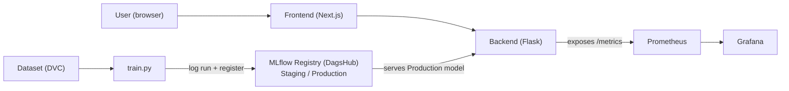

# League Win Predictor — MLOps Final Project

A web app that predicts the **blue team's win probability** in a ranked
**League of Legends** game, from the first-10-minutes stats. The game is just
the pretext — the real goal is the full **MLOps lifecycle** around the model:
versioned data, tracked models, a quality gate, CI/CD, and live monitoring.

- **Live app:** https://lol-frontend-scaw.onrender.com
- **Backend health:** https://lol-backend-awex.onrender.com/health
- **Model registry (DagsHub):** https://dagshub.com/wassimdjenane344/league-win-predictor.mlflow

---

## 1. Architecture


**The journey of a change** (each arrow runs automatically):

```
feature/*  ->  dev  ->  staging  ->  main
 (develop)   (integrate)  (validate)  (production)
```

| Layer | Tool | Role |
|---|---|---|
| Frontend | Next.js | the form + result the user sees |
| Backend | Flask (Python) | serves the model, `/predict` `/health` `/metrics` |
| ML | scikit-learn | the model (logistic regression) |
| Data versioning | DVC | versions the dataset (remote on DagsHub) |
| Experiments + registry | MLflow + DagsHub | tracks runs, stores model versions |
| Packaging | Docker | same image everywhere |
| CI/CD | GitHub Actions | 3 automatic pipelines |
| Hosting | Render | the live public app |
| Monitoring | Prometheus + Grafana | live production metrics |

---

## 2. CI/CD (3 pipelines)

Defined in `.github/workflows/`. GitHub Actions runs them automatically:

| Trigger | Pipeline | What it does |
|---|---|---|
| **PR -> `dev`** | `pr-to-dev.yml` | lint + unit + integration tests + build Docker images |
| **push -> `staging`** | `dev-to-staging.yml` | full test suite + e2e, then **train a candidate model** and register it as `Staging` |
| **push -> `main`** | `staging-to-main.yml` | **quality gate**, then promote + deploy to production |

A pull request can only be merged when its checks are green. Environment secrets
(`MLFLOW_*`, deploy hooks) live in the GitHub `staging` / `production`
Environments — never in the code (12-factor).

---

## 3. Model promotion (the quality gate)

This is the core of the `staging -> main` pipeline (`ml/src/promote.py`):

1. Take the model currently in the **`Staging`** stage (the candidate).
2. Re-evaluate it on a held-out test set.
3. **Quality gate:** `accuracy >= 0.70` (`ml/src/evaluate.py`).
   - **Pass ->** promote it to **`Production`** (previous version archived) and
     trigger the Render deploy. The backend then serves the new Production model.
   - **Fail ->** the script exits non-zero, the job fails, the deploy step never
     runs. The model stays in `Staging`; **production is unchanged.**

Because production only ever serves the `Production` stage, a model that fails
the gate can never reach users. Every training run is also traceable to a **DVC
data version** + a **git commit** (shown on every prediction in the UI).

Try it live: `python presentation/demo_quality_gate.py` shows a good model
passing and a bad one being blocked.

---

## 4. Tests

- **3 levels:** unit (small functions), integration (Flask API + real model),
  e2e (a real browser drives the live app via Selenium).
- They run **on every PR** in CI, and **before every push** via the
  `.githooks/pre-push` hook.

```bash
pytest tests/unit tests/integration -v
```

---

## 5. Monitoring

The backend exposes `/metrics`; Prometheus scrapes it and Grafana shows it.
To watch the **live production** backend:

```bash
docker compose -f docker-compose.monitoring.yml up
# Grafana: http://localhost:3001  (admin / admin) — dashboard auto-loaded
```

Dashboard panels: request volume, prediction latency (p95), failed requests,
backend health (UP/DOWN).

---

## 6. Reproduce it from scratch

```bash
git clone https://github.com/wassimdjenane344/league-win-predictor.git
cd league-win-predictor

python -m venv .venv && source .venv/Scripts/activate   # Windows: .venv\Scripts\activate
pip install -r requirements-dev.txt

dvc pull                                # fetch the dataset

cd ml/src
python train.py --model-type logreg --register   # train + register as Staging
python promote.py                                  # quality gate -> Production
cd ../..

# Run everything locally (app + monitoring) with Docker:
docker-compose up --build
```

MLflow uses DagsHub when `MLFLOW_TRACKING_URI` (+ username/token) is set;
otherwise it falls back to a local file store — no code change needed.

---

## 7. Project structure

```
backend/                        Flask API that serves the model (/predict /health /metrics)
frontend/                       Next.js UI (the prediction form)
ml/                             dataset + train.py / promote.py / evaluate.py (MLflow)
tests/                          unit / integration / e2e (Selenium)
monitoring/                     Prometheus config + Grafana dashboards (auto-provisioned)
scripts/                        helpers (install git hooks, set GitHub secrets)
.github/workflows/              the 3 CI/CD pipelines
.githooks/                      pre-push hook (lint + tests)
.dvc/  +  .dvc-remote/          DVC config + local data remote
.env.example                    environment variables template (12-factor)
pyproject.toml                  ruff (lint) + pytest config
requirements-dev.txt            Python dependencies
docker-compose.yml              run the whole app locally (app + monitoring)
docker-compose.monitoring.yml   run monitoring against the live production backend
render.yaml                     Render deploy blueprint (backend + frontend)
```
